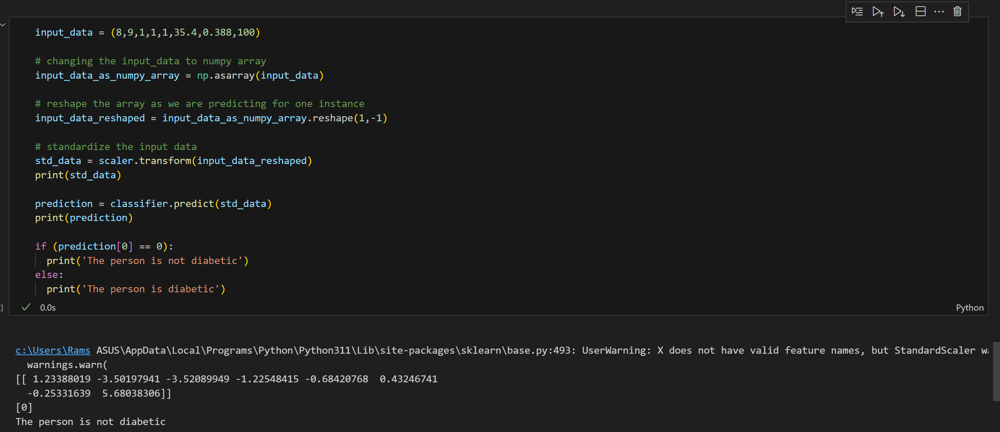
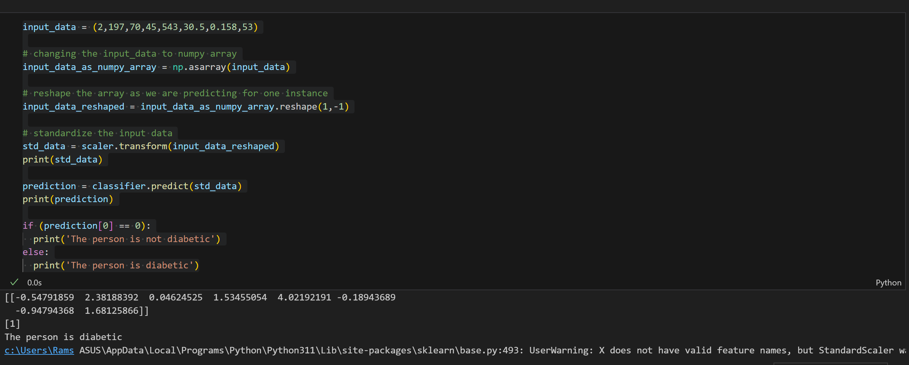

# Project Overview Diabetes_Detection_using_ML
This project aims to predict whether a person has diabetes based on several medical attributes. We employ machine learning algorithms to build a predictive model using the Pima Indians Diabetes Database. The goal is to detect diabetes early, aiding in timely medical intervention.

# Process Outline
Data Loading: We load the dataset, which contains various medical features like glucose levels, insulin, body mass index (BMI), and more. These features are used to predict the target variable — whether a person has diabetes (1) or not (0).

# Data Preprocessing:

Handling Missing Values: Since real-world data often has missing or null values, we handle these using appropriate techniques like filling with mean/median values or removing rows.
Feature Scaling: To ensure uniformity in the data, we scale the features (e.g., glucose, insulin, age) so that no feature dominates the learning process due to magnitude differences.
Splitting the Data: We split the dataset into training and testing sets (commonly 80% training, 20% testing) to evaluate model performance effectively.
# Model Building: 
We train different machine learning models to predict diabetes:

Logistic Regression: This is a linear model used for binary classification problems like this one.
Random Forest Classifier: An ensemble method that uses multiple decision trees to improve predictive accuracy.
Support Vector Machine (SVM): A powerful classifier used for high-dimensional data.
K-Nearest Neighbors (KNN): A non-parametric algorithm that classifies data points based on the majority vote of their neighbors.
# Model Evaluation: 
The models are evaluated based on metrics such as:

Accuracy: Percentage of correct predictions.
Precision, Recall, F1-Score: Metrics that evaluate the model's ability to distinguish between diabetic and non-diabetic individuals.
ROC-AUC: A measure of how well the model distinguishes between the two classes (diabetic vs. non-diabetic).
# Model Tuning: 
We use techniques like Grid Search or Randomized Search to optimize model hyperparameters for better performance.

# Prediction: 
After training and evaluation, the model is used to predict diabetes in new patients based on their medical data.

# Conclusion:
This project demonstrates how machine learning techniques can be applied to healthcare data to predict diabetes. By exploring various machine learning algorithms and evaluating their performance, we can identify models that provide accurate and reliable predictions. Early detection of diabetes can greatly benefit patients by enabling timely treatment and management of the disease, thereby reducing long-term complications.

The project emphasizes the importance of data preprocessing, model selection, and evaluation metrics in building a robust machine learning model. With further optimization and tuning, the model can be refined for even better performance. Future work may include exploring deep learning techniques, incorporating more features, or deploying the model into a real-time healthcare application.

# Output:

